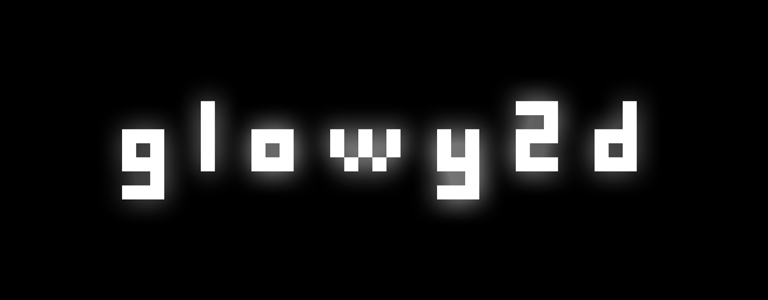

GLOWY2D
=======
This is 2D graphics engine/framework/wrapper written using C++11 and OpenGL. It's goal is to give the highest control and performance over 2D graphics with no (or almost no) overhead. 

Sometimes later it will support almost any platform (like Linux, Windows, Android, OSX, iOS) through different APIs (OpenGL 2.0 to 4.5, OpenGL ES 2.0 to 3.1 and may be WebGL), but now it is just on it's earliest development stage, so it supports only Windows.

FEATURES IT HAS NOW
===================
* **Layer / Sprite system**
  Layer has it's own texture. You have to add a sprite to a layer with an 
  new/existing image to get it showed. Each layer is a separate Vertex Buffer 
  Object. 
* **Automatic Texture Atlases**
  When image is added to layer, it's automatically being added to atlas, and 
  sprite is created so it will show the only new texture. You can reuse 
  images. Has automatic color borders for avoiding antialiasing artifacts
* Early version, hard-to-use shader system, image loading system
* Cameras, shedulers, config readers, etc...
* Uses OpenGL, and has almost working DirectX support (it's broken now)

FEATURES IT'S MAY BE GOING TO HAVE
===========================
* **High Effiency**
  You should be able to reach maximum performance using glowy2d. 
  Performance > Ease of use
* **Some kind of automatic mode**
  Which would simplify some things, like managing of updating buffers...
* **Cross-Platform Support**
  User is not going to care about any platform-specific issues like file 
  loading, OpenGL API using, etc.
* **Many convenience features**
  Like pre-written shaders for a different purposes, or like texture-
  -updating functions with different blending modes

HOW TO USE
==========
Now it's ready to use with GCC under MinGW, just run "cmake "MinGW Makefiles" .." from the "build" directory. It even has all the libraries compiled for this platform. If you want to use another compiler or another operating system, you have to recompile all the libraries and correct some stuff in CMakeLists.txt (sorry for that)

Libraries to compile:

External: glfw, glew, zlib, lpng - each placed in it's folder in "Glowy2D/dep" directory

glowy2d itself, use the CMakeLists.txt from "Glowy2D" directory.

After you build everything, you will see some example platformer with messed up hand-made physics :D

CONTRIBUTE?
===========
glowy2d is developing also in learning purposes, so if you want to correct my code,
or have an idea, or want to help, or anything, you can contact me: rasielll@gmail.com

CREDITS
=======
(c) 2015 Kvachev V. D.

This software also uses following libraries:

GLEW http://glew.sourceforge.net/

GLFW http://www.glfw.org/

GLM http://glm.g-truc.net/0.9.5/index.html

ZLIB

LPNG

So I wan't to thank anyone who developed those awesome libraries
